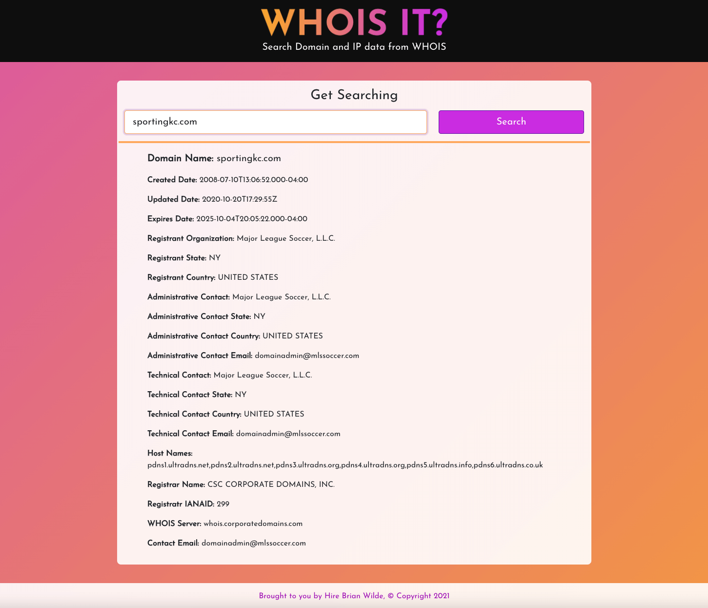

# Whois It?


## Table of Contents
* [Description](#description)
* [Assignment](#assignment)
* [Installation](#installation)
* [Usage](#usage)
* [Owners](#owners)
* [Credits](#credits)
* [License](#license)
* [Questions](#questions)

## Description
Whois It is an application to search for WHOIS information based on domain name or IP address. Built with React frontend, utilizing a Node/Express server backend and set up in containers with Docker. For the API calls to our backend, this app is interacting with WHOIS data courtesy of the [whoisxml API](https://main.whoisxmlapi.com/). 

## Assignment
The task for this project was given with the following criteria:
* The application(s) are deployed using Docker and running on a service of your choice. (almost ✅ )
* User can submit a domain or IP address into form and data is returned and displayed in the UI ✅ 
* Use one or more of the WHOIS APIs for accessing IP and domain data ✅ 
* Frontend is built with React ✅ 
* Server is built with Node ✅ 

### Continuing Development
* As noted above, Docker has been integrated into this project (per requirement 1), but has not been properly deployed yet. I am continuing to fix my deployment problems in another branch. I have spent about 12 hours as of the time of writing in troubleshooting containerized deployment via Heroku. When I have the app running on Heroku, a link will be updated here.
* GRAPHQL - My focus for this assignment was on delivering MVP meeting the above criteria while also showing my style and creative ability. I will next wrap my API calls in GraphQL using the Apollo REST data source.
* CI/CD - using Github actions and workflows, as well as Heroku integration, I will implement continuous integration and deployment.
* Unit Testing - using jest, I will implement testing on react components and api functionality.

## Installation
To run this app on your local machine:

1. Clone the repo - Navigate to the folder you'd like to store this app in locally in your command line and run this command:
```
git clone git@github.com:bgswilde/whois-it.git
```
2. Set up a .env file in the server directory and set up an API_KEY environment variable to hold your whoisxmlapi api key. You can signup and get your key at the [whoisxml API website](https://main.whoisxmlapi.com/).

3. a) With Docker installed on your computer, navigate to the root of the application in the command line and run this command to build the containers and run the application: 
```
make run-dev
```
3. b) If you don't have Docker, you can run this on your local environment through Node with these commands from the root of the application: 
```
npm install
```
(will install all needed app, client and server dependencies)
```
npm run-dev
```
(will concurrently run the backend server and react server)

4. The app will run for use at localhost:3000.

## Usage
As the screenshot below demonstrates, simply search by domain name or ip address in the search bar for WHOIS data. If your search is invalid, an error message will appear instead.



## Credits
As mentioned, this application utilizes data from the whoisxml api.

## License
[](https://opensource.org/licenses/MIT)
  
### MIT LICENSE

Permission is hereby granted, free of charge, to any person obtaining a copy of this software and associated documentation files (the "Software"), to deal in the Software without restriction, including without limitation the rights to use, copy, modify, merge, publish, distribute, sublicense, and/or sell copies of the Software, and to permit persons to whom the Software is furnished to do so, subject to the following conditions:

The above copyright notice and this permission notice shall be included in all copies or substantial portions of the Software.

THE SOFTWARE IS PROVIDED "AS IS", WITHOUT WARRANTY OF ANY KIND, EXPRESS OR IMPLIED, INCLUDING BUT NOT LIMITED TO THE WARRANTIES OF MERCHANTABILITY, FITNESS FOR A PARTICULAR PURPOSE AND NONINFRINGEMENT. IN NO EVENT SHALL THE AUTHORS OR COPYRIGHT HOLDERS BE LIABLE FOR ANY CLAIM, DAMAGES OR OTHER LIABILITY, WHETHER IN AN ACTION OF CONTRACT, TORT OR OTHERWISE, ARISING FROM, OUT OF OR IN CONNECTION WITH THE SOFTWARE OR THE USE OR OTHER DEALINGS IN THE SOFTWARE.

## Questions
I'm a growing developer! If you have any questions or feedback on this application, you can reach me (Brian Wilde) at bgswilde@gmail.com. At the time of writing, I am currently in the interview process with several potential employers and looking forward to working on a dev team and continuing to grow as a developer!
